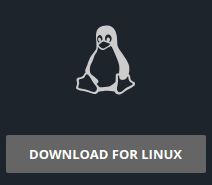

# Marmara Connector
[]()

[](https://github.com/marmarachain)

This GUI application provides control of the MCL system on the remote server.
  - Install MCL on Remote Server
  - Connect remote MCL server
  - See MCL info
  - Recive and transfer MCL
  - Create credit loop

## Download And Installation
[]()

[RELEASES](https://github.com/marmarachain/marmara-connector/releases)


Linux (Ubuntu-Debian)              |  Windows (Win10)
:-------------------------:|:-------------------------:
[](https://github.com/mucahittopcu/MCL-Remote-Server-Connection-GUI)|  [](https://github.com/mucahittopcu/MCL-Remote-Server-Connection-GUI)

### Ubuntu Installation

Go to downloaded file. Click MarmaraConnector.<br>
If the app does not work, check executable status of the file.

To authorize the application file to run:
```sh
chmod +x MarmaraConnector
```

### Windows Installation
Double-click the downloaded mcl-gui.exe file to install it.
You can run it with a shortcut on the desktop.<br>

After the application is installed, run it as an administrator.

[Download Here](https://github.com/marmarachain/marmara-connector/releases)
 
## For Developers
[]()
### Installation requirements

Install the dependencies and devDependencies

- PYTHON3 required


PYQT5 and Designer Installation
```sh
pip install PyQt5

sudo apt-get install qttools5-dev-tools
sudo apt-get install python3-pyqt5
sudo apt-get install pyqt5-dev-tools
```

### Development
[]()

If you want to improve the design and change the design, open the **"gui_designer.ui"** file with QT Designer.

The desired development can be made from the opened QT Designer screen.

After the design part is finished, the .ui file should be converted to the python file.

Convert code ui to python:
```sh
pyuic5 -x guiDesigner.ui -o guiDesign.py
```

Then a python file named **"guiDesign.py"** created.

Open the **mainApp.py** file with pycharm.

In the **mainApp.py** file, the file named **"guiDesign.py"** is import. **"Ui_MainWindow"** is extend to the class.

    from guiDesign import Ui_MainWindow  # Import
    
    class MainClassGUI(QMainWindow, Ui_MainWindow): #Extend
    
    def __init__(self, parent=None):
        super(MainClassGUI, self).__init__(parent)
        self.setupUi(self)

In this way, we can reach every feature of the GUI design.

We can try our project with the command below.

```sh
python3 mainApp.py
```

### Contact
 []()

Contact for information

| Social Media | Link |
| ------ | ------ |
| Webside | [http://www.marmara.io/en/][webside_link] |
| GitHub | [https://github.com/marmarachain][github_link] |
| Discord | [discord.gg/8mBSKC7][discord_link] |
| Detailed information | [It's here][info_eng]  |
| MCL Market | [http://mclmarket.com/][mcl_market]  |
| Mail | mucahittopcu0@gmail.com |
 
License
----

MIT - Free Software

   [webside_link]: <http://www.marmara.io/en/>
   [discord_link]: <discord.gg/8mBSKC7>
   [github_link]: <https://github.com/marmarachain>
   [info_eng]: <https://github.com/rumeysayilmaz/Marmara-v.1.0/blob/master/MCLUsageGuide.md>
   [mcl_market]: <http://mclmarket.com/>
  

